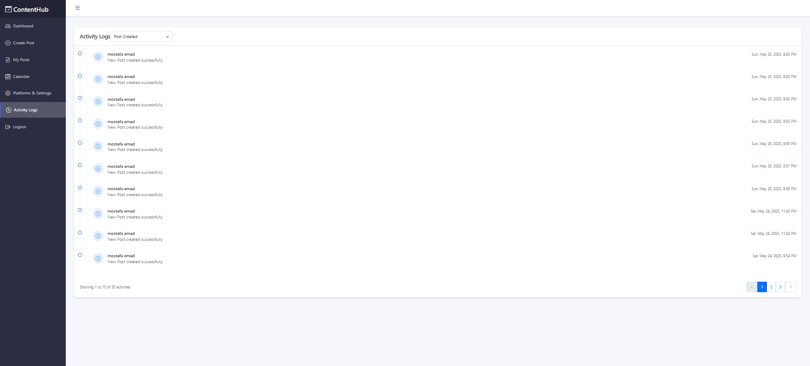

# Content Scheduler

A powerful Laravel-based application for scheduling, managing, and analyzing social media posts across multiple platforms. Designed for performance, extensibility, and a seamless user experience, it enables users to create, schedule, repost, and track posts with advanced analytics and platform-specific controls.

---

## Table of Contents

1. [Features](#features)
2. [Feature Explanations](#feature-explanations)
3. [Installation &amp; Setup](#installation--setup)
4. [API Documentation](#api-documentation)
    - [Authentication](#authentication)
    - [Profile](#profile)
    - [Posts](#posts)
    - [Platforms](#platforms)
    - [Analytics](#analytics)
    - [Activity Logs](#activity-logs)
5. [Filters &amp; Query Parameters](#filters--query-parameters)
6. [Repost Feature](#repost-feature)
7. [Global Error Handling &amp; Response Structure](#global-error-handling--response-structure)
8. [Testing &amp; Factories](#testing--factories)
9. [Caching &amp; Queue](#caching--queue)
10. [Security &amp; Extensibility](#security--extensibility)
11. [Website Images](#website-images)

---

## Features

-   **User Authentication:** Register, login, logout, and manage user profiles (Laravel Sanctum).
-   **Post Management:** Create, schedule, update, delete, and repost posts (draft/scheduled/published).
-   **Repost Feature:** Instantly duplicate any post as a draft for easy rescheduling or editing.
-   **Platform Integration:** Twitter, Instagram, LinkedIn (easily extensible).
-   **Scheduling & Publishing:** Queue-based, with command to process due posts.
-   **Analytics:** Per-platform stats, publish success rate, scheduled vs published, upcoming posts.
-   **Rate Limiting:** Max 10 scheduled posts per user per day.
-   **Activity Logging:** User actions tracked and viewable, with filters.
-   **Caching:** Platforms and analytics cached (Redis or DB), with auto-invalidation.
-   **Factory Pattern:** Used for platform publishing services for extensibility.
-   **Testing:** Feature tests, model factories, seeders.
-   **Global Error Handling:** Consistent API responses and error structure.

---

## Feature Explanations

### Post Management

Create, update, delete, and schedule posts for multiple platforms. Posts can be drafts, scheduled, or published. Each post can be associated with one or more platforms.

### Repost Feature

Duplicate any post as a draft for quick rescheduling or editing. This is useful for recurring or similar content.

### Analytics

Get insights into your posting activity: total posts, posts by status, posts per platform, upcoming scheduled posts, and publishing success rate.

### Rate Limiting

Each user is limited to 10 scheduled posts per day. Attempts to exceed this limit will result in an error response.

### Activity Logging

All significant user actions (login, post creation, platform toggling, etc.) are logged and can be viewed and filtered.

### Caching

Platforms and analytics are cached for performance. Cache is automatically invalidated when relevant data changes.

### Scheduling & Publishing

Posts scheduled for the future are published automatically by a Laravel command/job. The queue can use the database or Redis.

### Platform Management

The application supports multiple social platforms (Twitter, Instagram, LinkedIn, etc.), each with:

-   **Global properties:** name, type, character limits, dynamic requirements (e.g., image required, link support).
-   **Per-user settings:** Each user can activate/deactivate platforms and store platform-specific settings (API keys, tokens, etc.) for each platform.
-   **List all available platforms:** See all platforms supported by the system, including their requirements and character limits.
-   **Toggle platform active/inactive:** Each user can activate or deactivate any platform for their account.
-   **Per-user platform settings:** Each user can store and update settings (API keys, tokens, etc.) for each platform. The required settings for each platform are defined by the platform and returned as `settingskeys`.
-   **Extensible:** Add new platforms by implementing a publishing service and updating the factory.

---

## Installation &amp; Setup

### Prerequisites

-   PHP >= 8.2
-   Composer
-   MySQL
-   Redis (optional, for improved caching and queues)

### Steps

1. **Clone & Install**

    ```bash
    git clone https://github.com/mostafa123c/content-schedular
    cd content-schedular
    composer install
    ```

2. **Environment**

    ```bash
    cp .env.example .env
    php artisan key:generate
    # Edit .env for DB, cache, and queue settings
    ```

3. **Database**

    ```bash
    php artisan migrate --seed
    ```

4. **Storage**

    ```bash
    php artisan storage:link
    ```

5. **Queue & Scheduler**

    - In `.env`:

        ```
        CACHE_STORE=database
        QUEUE_CONNECTION=database
        ```

        (Change to `redis` if you have Redis running on port 6379)

    - Start the queue worker:

        ```bash
        php artisan queue:work
        ```

    - Add to your crontab (production):

        ```
        * * * * * cd /path-to-project && php artisan schedule:run >> /dev/null 2>&1
        ```

    or you can test the scheduler manually by scheduling a post (after 1 minute for examole) and run the queue

    - Start the Schedular:
        ```bash
        php artisan schedule:runspan
        ```

---

## API Documentation

### Authentication

| Method | URL              | Description       | Fields                                       |
| ------ | ---------------- | ----------------- | -------------------------------------------- |
| POST   | /api/v1/register | Register new user | name, email, password, password_confirmation |
| POST   | /api/v1/login    | Login             | email, password                              |
| POST   | /api/v1/logout   | Logout (auth)     | -                                            |
| POST   | /api/v1/refresh  | Refresh token     | -                                            |

### Profile

| Method | URL                      | Description      | Fields                                            |
| ------ | ------------------------ | ---------------- | ------------------------------------------------- |
| GET    | /api/v1/profile          | Get user profile | -                                                 |
| PUT    | /api/v1/profile          | Update profile   | name, email                                       |
| PUT    | /api/v1/profile/password | Update password  | current_password, password, password_confirmation |

### Posts

| Method | URL                       | Description                 | Fields                                                       |
| ------ | ------------------------- | --------------------------- | ------------------------------------------------------------ |
| GET    | /api/v1/posts             | List posts (with filters)   | See[Filters](#filters--query-parameters)                     |
| POST   | /api/v1/posts             | Create post                 | title, content, image_url, scheduled_time, status, platforms |
| GET    | /api/v1/posts/{id}        | Get post details            | -                                                            |
| PUT    | /api/v1/posts/{id}        | Update post                 | Same as create                                               |
| DELETE | /api/v1/posts/{id}        | Delete post                 | -                                                            |
| POST   | /api/v1/posts/{id}/repost | Repost as draft             | -                                                            |
| GET    | /api/v1/user/posts        | List user's posts (filters) | See[Filters](#filters--query-parameters)                     |

### Platforms

| Method | URL                             | Description                           | Fields   |
| ------ | ------------------------------- | ------------------------------------- | -------- |
| GET    | /api/v1/platforms               | List all available platforms          | -        |
| GET    | /api/v1/user/platforms          | List user's active/inactive platforms | -        |
| POST   | /api/v1/platforms/{id}/toggle   | Toggle platform active/inactive       | -        |
| GET    | /api/v1/platforms/{id}/settings | Get platform settings for user        | -        |
| PUT    | /api/v1/platforms/{id}/settings | Update platform settings for user     | settings |

### Analytics

| Method | URL               | Description    | Fields |
| ------ | ----------------- | -------------- | ------ |
| GET    | /api/v1/analytics | User analytics | -      |

### Activity Logs

| Method | URL                         | Description                       | Fields                                   |
| ------ | --------------------------- | --------------------------------- | ---------------------------------------- |
| GET    | /api/v1/activity-logs       | List activity logs (with filters) | See[Filters](#filters--query-parameters) |
| GET    | /api/v1/activity-logs/types | List log action types             | -                                        |

---

## Filters &amp; Query Parameters

### Posts & User Posts

-   `status` (0=draft, 1=scheduled, 2=published)
-   `sort_key` (created_at, scheduled_time)
-   `sort_type` (asc, desc)
-   `start_date` (scheduled_time)
-   `end_date` (scheduled_time)
-   `page` (int)

### Activity Logs

-   `action`
-   `start_date` (created_at)
-   `end_date` (created_at)
-   `sort_key`
-   `sort_type`
-   `page` (int)

---

## Repost Feature

Duplicate any post as a draft for quick rescheduling or editing. Use the `POST /api/v1/posts/{id}/repost` endpoint.

---

## Global Error Handling &amp; Response Structure

-   All API responses are unified using a shared resource.
-   **Success:** `{ "success": true, "data": { ... }, "message": "..." }`
-   **Error:** `{ "success": false, "message": "Error message", "errors": { ... } }`
-   Validation and server errors are always returned in this format for consistency.

---

## Testing &amp; Factories

-   **Run all tests:** `php artisan test`
-   **Model Factories:** For all entities in `database/factories` for testing purposes
-   **Seeders:** For platforms data in `database/seeders` for platforms & settings seeding
-   **Postman Collectioction:** Added postman collection for Api endpoints test (Content Schedular Task.postman_collection.json)
-   **Manual Publishing Test:**
    1. Schedule a post for 1 minute in the future.
    2. Ensure the queue worker is running: `php artisan queue:work`
    3. Trigger the publishing command: `php artisan process:due-posts`
    4. Check post status, logs, and analytics.

---

## Caching &amp; Queue

-   **Caching:** Platforms and analytics are cached (DB or Redis). Cache is auto-cleared on create/update/delete.
-   **Queue:** Supports database or Redis. All publishing is handled via the queue.

---

## Security &amp; Extensibility

-   CSRF, XSS, SQL injection protection
-   Rate limiting at API and service layer
-   Easily add new platforms by implementing a publishing service and updating the factory (factory design pattern is used for platform extensibility)

---

## Website Images

Below are screenshots of the main pages of the application:

### Login


### Register


### Analytics

The analytics page provides insights into your posting activity, including post counts, status breakdown, per-platform stats, upcoming posts, and publishing success rate.


### Create Post


### All Posts


### Calendar


### Platform and Settings


### Activity Logs



```bash
	php artisan schedule:run
```
